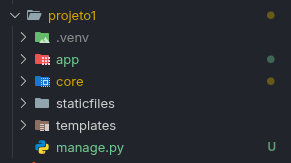

<h1 align="center">Aprendendo Django</h1>
<p align="center">Repositório para brincar com as funcionalidades do Framework Django<p>
<p align="center">O limite é a imaginação e a diversão</p>

## Comandos iniciais
Antes de tudo, crie uma pasta com o nome do seu projeto e execute os comandos dentro da pasta que você criou.

### Criar e ativar ambiente virtual 
```shell
# Windows - Powershell
python -m venv .venv
.\.venv\Scripts\Activate.ps1

# Linux
python3 -m venv .venv
source .venv/bin/activate
```

### Instalar o Django
```shell
pip install django
```

### Iniciar projeto
```shell
django-admin startproject core .
```

### Criar app
```shell
python manage.py startapp app
```

## Configurações 
- As configurações serão feitas nos arquivos `setting.py` e `urls.py` do módulo `core`
- Crie uma pasta com o nome `templates` e outra com o nome `staticfiles` na raiz do projeto



### No arquivo `settings.py`
```python
# ...

PROJECT_APPS = [
    'app',
]

INSTALLED_APPS += PROJECT_APPS

# ...

TEMPLATES = [
    {
        'BACKEND': 'django.template.backends.django.DjangoTemplates',
        'DIRS': [ BASE_DIR / "templates" ],
        'APP_DIRS': True,
        'OPTIONS': {
            'context_processors': [
                'django.template.context_processors.request',
                'django.contrib.auth.context_processors.auth',
                'django.contrib.messages.context_processors.messages',
            ],
        },
    },
]

# ...

MEDIA_URL = 'media/'
STATIC_URL = 'static/'

if DEBUG:
    STATICFILES_DIRS = [ BASE_DIR / 'staticfiles' ]
    MEDIA_ROOT = [ BASE_DIR / 'media' ]
else:
    STATIC_ROOT = [ BASE_DIR / 'static' ]

# ...
```
### No arquivo `urls.py`
```python
from django.contrib import admin
from django.urls import path
from django.conf import settings
from django.conf.urls.static import static

urlpatterns = [
    path('admin/', admin.site.urls),
]

if settings.DEBUG:
    urlpatterns += static(settings.STATIC_URL, document_root=settings.STATIC_ROOT)
    urlpatterns += static(settings.MEDIA_URL, document_root=settings.MEDIA_ROOT)
```

## Referências
### Configuração de arquivos estáticos
- [Django documentation - Static for deployment](https://docs.djangoproject.com/en/5.2/howto/static-files/deployment/)
- [Django documentation - Static on server](https://docs.djangoproject.com/en/5.2/howto/deployment/wsgi/modwsgi/#serving-files)
- [Django documentation - Media Files](https://docs.djangoproject.com/en/5.2/ref/settings/#std-setting-MEDIA_ROOT)
- [Medium - Media files settings](https://medium.com/django-unleashed/working-and-configuring-media-files-in-django-0c2fa7b97a1e)