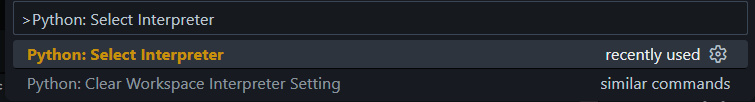
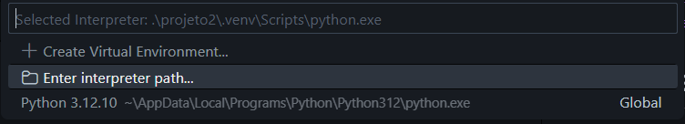
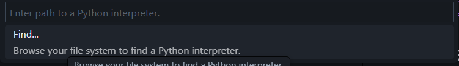
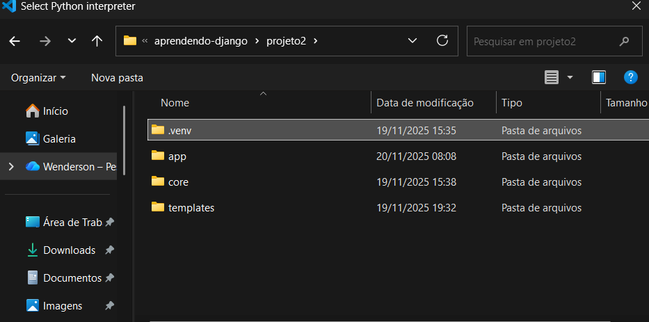
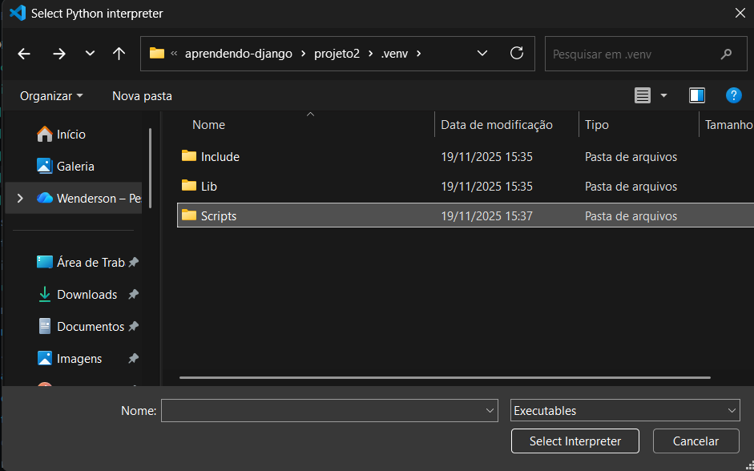
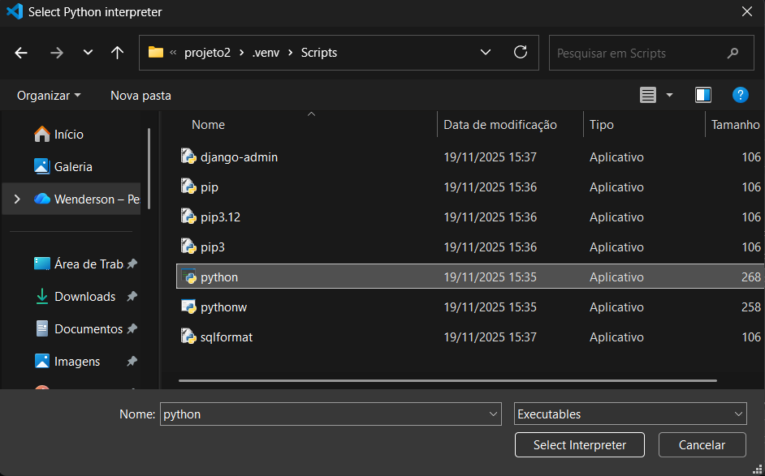

# Utilidades
## Bug da Venv no VSCode
Quando cria-se um ambiente virtual com `python -m venv .venv`, um novo executável do python é criado dentro de `.venv`. No entanto, o visual studio code é configurado para usar o executável global. Dessa forma, ao instalar pacotes no ambiente virtual, o vscode não localiza-os porque estão em um local isolado.

Para resolver esse problema siga os passos seguintes: 

### Selecione o executável do ambiente virtual

`CTRL + SHIFT + P`

1° passo:


2° passo:


3° passo:


4° passo:


5° passo:


6° passo:


### Ative a venv no terminal

```shell
# Powershell
.\.venv\Scripts\activate

# Linux
source .venv/Scripts/activate
```

É necessário ativar o ambiente virtual via comando também. Fique atento, pois possa ser necessário realizar esses passos sempre que criar um novo projeto com python (essa conclusão é especulação minha). 